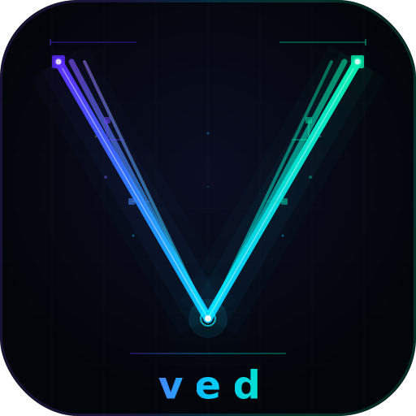
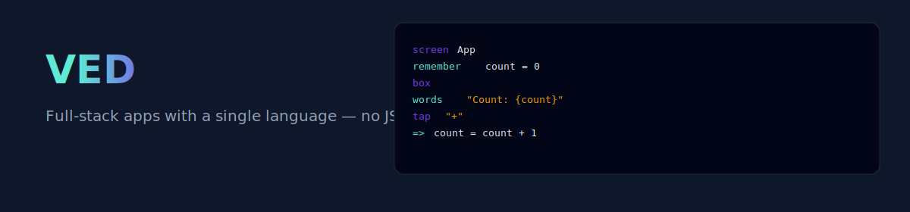
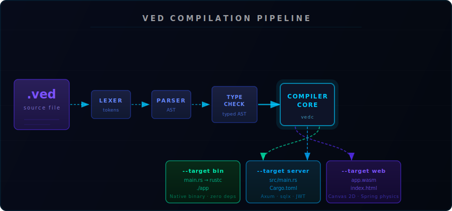

# VED

<div align="center">
  
  

[](https://github.com/vornyx-rs/VeD-LaNg/actions)
[](https://github.com/vornyx-rs/VeD-LaNg/releases)
[](#testing)
[](#license)

</div>

## Vibe Coded

This project was built for fun — a vibe coding experiment to see how far a language compiler can be taken in one go. It is not backed by a company or team. There are known gaps (see [Implementation Status](#implementation-status)). If you find something broken, open an issue rather than a meme. Contributions are genuinely welcome.

---
> A unified programming language for frontend, backend, and systems — compiled to WebAssembly, native binary, and server from one `.ved` source file.

VED is a language with Python-style indentation that compiles to three targets from the same source:

- **`--target web`** — emits an HTML shell + JS runtime + Rust source compiled to WASM (`wasm32-unknown-unknown`)
- **`--target server`** — transpiles to an [Axum](https://github.com/tokio-rs/axum) Rust project, then compiles
- **`--target bin`** — transpiles to Rust, then compiles to a native binary with `rustc`

The compiler (`vedc`) is written in Rust. The lexer uses [logos](https://github.com/maciejhirsz/logos), error reporting uses [miette](https://github.com/zkat/miette), and the CLI uses [clap](https://github.com/clap-rs/clap).

---

## Table of Contents

- [Quick Start](#quick-start)
- [Language Reference](#language-reference)
  - [Shared Syntax](#shared-syntax)
  - [Client-Side (Web UI)](#client-side-web-ui)
  - [Server-Side](#server-side)
  - [Type System](#type-system)
  - [Standard Library](#standard-library)
- [CLI Reference](#cli-reference)
- [Build Targets](#build-targets)
- [Implementation Status](#implementation-status)
- [Architecture](#architecture)
- [Building from Source](#building-from-source)
- [Testing](#testing)
- [Contributing](#contributing)
- [License](#license)

---

## Quick Start

### Install

**Linux / macOS (one-liner):**

```bash
curl -fsSL https://raw.githubusercontent.com/vornyx-rs/VeD-LaNg/main/install.sh | bash
```
**Windows:** download `vedc-windows-x86_64.zip` from the [latest release](https://github.com/vornyx-rs/VeD-LaNg/releases/latest), extract, and add to PATH.

**From source (requires Rust 1.75+):**

```bash
git clone https://github.com/vornyx-rs/VeD-LaNg
cd VeD-LaNg
cargo build --release
# binary: target/release/vedc
```

**VS Code extension:** search "VED Language" in the Extensions panel (publisher: `vornyxrs`).

### Create a project

```bash
vedc new my-app          # full app (client + server template)
vedc new my-api --template server
vedc new my-lib --template lib
```

### Run a file (interpreted mode)

```bash
vedc run hello.ved
vedc run app.ved --target web
vedc run api.ved --target server
```

### Build

```bash
vedc build app.ved --target web     # → dist/index.html + dist/ved-runtime.js
vedc build app.ved --target bin     # → dist/app
vedc build api.ved --target server  # → dist/src/main.rs + dist/Cargo.toml
vedc build app.ved --target all     # → dist/fullstack/ + dist/bin/
```

---

## Language Reference

### Shared Syntax

VED uses Python-style indentation. Blocks are indented 2 spaces. Comments use `--`.

#### Variables

```ved
let x = 10          -- immutable binding
mut let y = 20      -- mutable binding
let name: text = "Alice"  -- explicit type
```

#### Functions (`think`)

```ved
think add needs a: num, b: num -> num
  give a + b

think greet needs name: text -> text
  give "Hello, {name}!"

-- async function
async think fetchUser needs id: num -> maybe[User]
  let res = wait fetch "/api/users/{id}"
  give res
```

#### Control flow

```ved
-- when (pattern matching / if-elseif-else)
when
  x > 10 =>
    println "big"
  x > 0 =>
    println "positive"
  otherwise =>
    println "zero or negative"

-- each (for loop)
each item in items
  println "{item}"

-- loop over a range
each i in [1, 2, 3, 4, 5]
  println "{i}"
```

#### Types (`shape`)

```ved
shape Point
  x: num
  y: num

shape User
  name: text
  email: text
  age: num = 0    -- default value

-- instantiate
let p = Point { x: 10, y: 20 }
let p2 = p with { x: 99 }   -- struct update syntax
```

#### Error handling

```ved
-- Ok[T, E] result type
think divide needs a: dec, b: dec -> ok[dec, text]
  when
    b = 0 => fail "division by zero"
    otherwise => give a / b

-- call with handle
let result = divide(10.0, 2.0)
  ok r => println "Result: {r}"
  fail e => println "Error: {e}"

-- try propagation (like ? in Rust)
let value = try divide(a, b)
```

#### Null safety

```ved
-- maybe[T] is the nullable wrapper
let name: maybe[text] = nothing

when
  name is nothing => println "no name"
  otherwise => println "name: {name}"
```

#### Pipe operator

```ved
let result = [1, 2, 3, 4, 5]
  |> keep(x => x > 2)
  |> each(x => x * 10)
  |> fold(0, (acc, x) => acc + x)
```

#### String interpolation

```ved
let greeting = "Hello, {name}! You are {age} years old."
let raw = #"no {interpolation} here"#
```

#### Async / await

```ved
async think loadData -> ok[list[User], text]
  let users = wait fetch "/api/users"
  give users
```

---

### Client-Side (Web UI)

Client-side code uses `screen` (pages) and `piece` (reusable components). Target is detected automatically when `screen` or `box` keywords are present.

#### Screens and state

```ved
screen Counter
  remember count = 0       -- reactive state, triggers re-render on change
  remember doubled = count * 2  -- computed (depends on count)

  box main
    center: both
    fill: #0a0a0a
    gap: 24

    words "{count}"
      size: 64
      weight: fat
      color: #7f6fe8

    tap "+"
      fill: #7f6fe8
      radius: 8
      padding: 12 24
      => count = count + 1

    tap "−"
      fill: #333
      radius: 8
      padding: 12 24
      => count = count - 1
```

#### Reactive fetch

```ved
screen UserList
  remember users = nothing

  fetch users from "/api/users"
    when auth        -- re-fetches when auth state changes
    cache: 60s
    loading: Spinner
    error: ErrorBanner

  box
    each user in users
      words "{user.name}"
```

#### Layout properties (on `box`)

| Property | Values | Description |
| --- | --- | --- |
| `fill` | `#hex`, named color | Background color |
| `tall` | `whole`, `half`, number | Height |
| `flow` | `down`, `across`, `wrap`, `layer` | Flex direction |
| `gap` | number | Space between children |
| `padding` | number or `top right bottom left` | Inner spacing |
| `center` | `both`, `across`, `down` | Centering shorthand |
| `radius` | number | Border radius |
| `border` | width color | Border |
| `shadow` | blur color x y | Box shadow |
| `blur` | number | Backdrop blur |
| `opacity` | number | Opacity |
| `scroll` | `yes`/`no` | Overflow scroll |
| `clip` | `yes`/`no` | Overflow hidden |
| `cursor` | `pointer`, etc. | Cursor style |
| `layer` | number | z-index |
| `push` | `right`, `left`, `bottom` | Margin-auto push |

#### Text properties (on `words`)

| Property | Values |
| --- | --- |
| `size` | number (px) |
| `weight` | `fat`, `normal`, `thin` |
| `color` | `#hex`, named |
| `align` | `left`, `center`, `right` |
| `spacing` | number (letter-spacing) |
| `lines` | number (line clamp) |
| `cut` | number (truncate at) |

#### Interactive elements

```ved
-- Button with guard and confirm
tap "Delete"
  fill: #e53e3e
  guard: isAdmin          -- only fires if isAdmin is truthy
  confirm: yes            -- shows confirmation dialog
  => deleteItem(id)

-- Text input with binding
field "Search..."
  => query               -- binds to 'query' state variable

-- Password input
field "Password"
  secret: yes
  => password

-- Image
image "/assets/logo.png"
  tall: 48
```

#### Animation

```ved
box card
  enter:
    from: { opacity: 0, scale: 0.95 }
    to: { opacity: 1, scale: 1 }
    physics: spring
      stiffness: 120
      damping: 14
      mass: 1

  hover:
    scale: 1.02
    physics: spring

  leave:
    opacity: 0
    duration: 200ms
    ease: linear

  press:
    scale: 0.98

tap "Slide"
  animate:
    physics: spring
    stiffness: 80
    damping: 10
```

#### Gestures

```ved
box carousel
  flow: across
  snap: yes
  pan:
    direction: horizontal
    release:
      next_slide:
        velocity_threshold: 0.5
```

#### Lazy hydration

```ved
box heavy-section
  lazy: yes        -- only hydrates when scrolled into view (IntersectionObserver)
```

#### Ghost mode (AI-native, partial)

```ved
screen Dashboard
  ghost: yes
  -- VED captures natural-language comments as intent metadata
  -- Ghost overlay appears in dev builds showing captured intents
```

#### Reusable components (`piece`)

```ved
piece Button needs label: text, color: text
  tap "{label}"
    fill: color
    radius: 8
    padding: 12 24

-- Usage:
Button { label: "Save", color: "#7f6fe8" }
```

#### Routing

```ved
routes
  "/" => Home
  "/about" => About
  "/users/{id}" => UserDetail
  otherwise => NotFound

-- Navigate
tap "Go Home"
  => go "/"

tap "Back"
  => back
```

#### Server-side rendering / streaming

```ved
screen Article
  stream: yes      -- renders to static HTML first, then hydrates lazily
```

#### Events

```ved
box interactive
  on load =>
    println "mounted"

  on key "Enter" =>
    submitForm()

  on tap =>
    handleClick()

  on hover =>
    setHovered(yes)
```

#### Live collaboration (`sync`)

Presence and CRDT-backed state sync over WebSocket:

```ved
screen CollabEditor
  sync: automatic
  presence: yes
  transform: lww        -- Last-Write-Wins (also: pncounter, gcounter, mvregister)
```

---

### Server-Side

Server code runs when `serve`, `database`, `task`, `queue`, or HTTP method keywords are present.

#### HTTP server

```ved
serve Api
  port: 8080
  prefix: "/v1"
  guard: requireAuth      -- applied to all routes

  GET  "/users"        => listUsers
  POST "/users"        => createUser
  GET  "/users/{id}"   => getUser
  PUT  "/users/{id}"   => updateUser
  DEL  "/users/{id}"   => deleteUser

think listUsers
  let users = db all Users
  give users

think createUser
  let body = request.body
  let user = db save Users body
  give user

think getUser
  let id = param "id"
  let user = db one Users id
  when
    user is nothing => fail "not found"
    otherwise => give user
```

#### Database

```ved
database main
  kind: sqlite
  url: "sqlite:./app.db"
  pool: 10

-- Or Postgres:
database main
  kind: postgres
  url: env "DATABASE_URL"
  pool: 20

-- Operations (used inside think blocks)
let all = db all Users
let one = db one Users userId
let saved = db save Users newRecord
db remove Users userId

-- Raw query
let results = db query "SELECT * FROM users WHERE age > $1" [18] as list[User]

-- Transaction
transaction
  db save Orders order
  db save Inventory updated
```

Supported databases: **SQLite**, **PostgreSQL** (via [sqlx](https://github.com/launchbrock/sqlx)). MySQL support is planned for v1.1.

#### Authentication

```ved
auth jwt
  secret: env "JWT_SECRET"
  expires: 24h

-- Guard function
think requireAuth
  let token = request.header "Authorization"
  let claims = verify token
  when
    claims is nothing => fail "unauthorized"
    otherwise => give claims
```

Supported auth: **JWT** (HS256), **Basic**, **OAuth** (Basic and OAuth are defined in the AST; JWT is the only fully-wired runtime).

#### Background tasks

```ved
task cleanup
  every: 1h
  println "running cleanup..."
  db query "DELETE FROM sessions WHERE expires < now()"

task report
  at: "09:00"
  send_report()
```

#### Job queues

```ved
queue emails
  workers: 4
  retry: 3

think sendEmail needs job: EmailJob
  -- process job
```

#### WebSocket (`live`)

```ved
live chat
  path: "/ws/chat"

  on connect user =>
    broadcast "system" "{user} joined"

  on message user, msg =>
    broadcast "chat" "{ user: user, text: msg }"

  on leave user =>
    broadcast "system" "{user} left"
```

---

### Type System

VED has a static type system with inference. Types do not need to be annotated in most cases.

| VED type | Description |
| --- | --- |
| `num` | 64-bit integer |
| `dec` | 64-bit float |
| `text` | UTF-8 string |
| `bool` | `yes` / `no` |
| `list[T]` | typed list |
| `map[K, V]` | hash map |
| `maybe[T]` | nullable wrapper (null safety) |
| `ok[T, E]` | result type for error handling |
| `nothing` | unit / null |
| `any` | escape hatch (untyped) |

Function types: `fn(num, num) -> num`

Custom types are defined with `shape`. The type checker maintains a scoped environment and resolves builtin signatures from the standard library.

---

### Standard Library

~60 builtin functions available in all targets:

**I/O**: `print`, `println`, `input`, `exit`

**Strings**: `trim`, `len`, `upper`, `lower`, `split`, `join`, `replace`, `contains`, `starts_with`, `ends_with`, `slice`

**Numbers**: `floor`, `ceil`, `round`, `abs`, `sqrt`, `pow`, `log`, `sin`, `cos`, `tan`, `min`, `max`, `clamp`

**Lists**: `first`, `last`, `rest`, `sort`, `reverse`, `take`, `drop`, `each`, `keep`, `find`, `any`, `all`, `fold`, `append`, `prepend`, `concat`, `unique`

**Maps**: `keys`, `values`, `has`, `get`, `set`, `remove`, `merge`

**Time**: `now`, `today`, `sleep`, `format_time`, `parse_time`

**JSON**: `to_json`, `from_json`

**HTTP**: `fetch`, `fetch_post`, `encode_url`, `decode_url`

**Crypto/Random**: `hash`, `hash_file`, `random`, `random_int`, `uuid`

---

## CLI Reference

```text
vedc <COMMAND> [OPTIONS]

Commands:
  run     Run a .ved file (interpreted mode)
  build   Compile a .ved file to a target
  check   Type-check without running
  fmt     Format source (partial — see status)
  test    Run tests (partial — see status)
  ast     Print the AST (debug/json/pretty)
  lex     Print token stream
  lsp     Start language server (scaffold only)
  new     Create a new project
Global:
  -v, --verbose   Print compilation stages

run:
  --target auto|web|bin|server  (default: auto)

build:
  --target auto|web|bin|server|all  (default: bin)
  --out <dir>                         (default: dist)
  --release                           optimized build

check:
  --strict    treat warnings as errors

fmt:
  --check     check without writing
  --stdout    write to stdout

test:
  --pattern <glob>
  <file>

ast:
  --format debug|json|pretty  (default: debug)

lex:
  --whitespace    include whitespace tokens

new:
  --template app|client|server|lib  (default: app)
  --here    create in current directory
```

**Target auto-detection** (used when `--target auto`): inspects the source for `serve`/`database`/`GET`/`POST` → server; `screen`/`box`/`words`/`tap`/`remember` → web; otherwise → bin.

---

## Build Targets

### `--target web`

Emits to `dist/`:

- `index.html` — HTML shell with full CSS reset and optional SSR markup
- `ved-runtime.js` — JavaScript runtime including:
  - Spring physics animation engine (CPU)
  - CRDT primitives (LWW register, presence system)
  - Gesture handler (pan, snap)
  - Safe-tap / guard / confirm wiring
  - Ghost overlay (dev builds)
  - Lazy hydration via IntersectionObserver
- `app.wasm` — **placeholder binary** (actual WASM codegen not yet implemented)
- `ghost-intents.json` — captured intent metadata (if `ghost: yes` screens exist)

> The JS runtime initialises a `VEDRuntime` class and renders screen names on a `<canvas>`. Full DOM/WASM rendering of UI nodes is pending.

### `--target server`

Emits to `dist/`:

- `src/main.rs` — Axum server with all HTTP routes wired (GET/POST/PUT/PATCH/DELETE), JWT auth scaffold, AppState struct, health endpoint
- `Cargo.toml` — with axum, sqlx, tokio, jsonwebtoken, serde, tracing

To run the output:

```bash
cd dist && cargo build [--release]
./target/release/ved-server
```

### `--target bin`

Emits to `dist/`:

- `main.rs` — generated Rust code for `think` functions, shapes, and statements
- Immediately compiled with `rustc` → `dist/app`

### `--target all`

Emits both `dist/fullstack/` (web + server combined) and `dist/bin/`.

---

## Implementation Status

Honest accounting of what works and what doesn't.

### Working

| Component | Status |
| --- | --- |
| Lexer | Complete. logos-based, Python-style indentation, all token types |
| AST | Complete. All client, server, and shared node types defined |
| Parser | Complete. Recursive descent, parses all language constructs |
| Type checker | Working. Scoped TypeEnv, builtin resolution, basic inference |
| Interpreter | Working. Tree-walk eval for `think` functions, expressions, arithmetic, HTTP calls (blocking via reqwest) |
| Web compiler (HTML/JS/WASM) | Working. Emits HTML shell, JS runtime, and Rust source compiled to `app.wasm` via `wasm32-unknown-unknown`. Spring physics, tap dispatch, layout engine, and state all wired. |
| Server compiler | Working. Generates compilable Axum Rust project with all HTTP methods |
| Native compiler | Working. Transpiles `think` blocks to Rust, invokes `rustc` |
| Fullstack compiler | Working. Combines web + server passes |
| Animation (CPU) | Complete. Spring physics with stiffness/damping/mass, deterministic |
| JWT auth runtime | Complete. HS256 encode/decode via jsonwebtoken |
| DB config validation | Complete. SQLite/Postgres/MySQL URL validation |
| Docker generation | Complete. Emits Dockerfile + docker-compose.yml |
| Tree shaking | Working. Symbol-reachability based |
| Package manifest | Working. JSON read/write |
| `vedc run` | Working for bin/native target. Web/server targets print info but don't launch a browser or server |
| `vedc build` | Working for all targets |
| `vedc check` | Working |
| `vedc new` | Working. All four templates |
| `vedc ast` / `vedc lex` | Working |
| Tests | **47 passing, 0 failing** (`cargo test`) |

### Partial / Stub

| Component | Status |
| --- | --- |
| Web `run` mode | Prints a one-line summary; does not launch a browser or local dev server |
| Server `run` mode | Starts an Axum server on the configured port; only GET handlers are wired in the runtime interpreter. POST/PUT/PATCH/DEL routes in the server compiler output are correct |
| `vedc fmt` | Prints "Formatting not yet fully implemented". Tokenization works; pretty-printing pass is missing |
| `vedc test` | Parses and type-checks the file; no test runner |
| LSP (`vedc lsp`) | Scaffold only: protocol loop not implemented |
| AST JSON output | Prints "JSON output not yet implemented" |
| Ghost AI mode | Token, AST, and JS overlay infrastructure exists. AI intent engine is not implemented |
| WebGPU animation | Feature-gated stub behind `--features webgpu`. CPU spring backend is the default and fully works |
| Dev server | Module exists; integration with `vedc run --target web` not wired |
| Minifier | Module exists; implementation not verified |
| `each` in UI | Children do not receive the loop variable in canvas draw context |
| `parse_time` | Returns 0; chrono integration pending |
| CRDT live collab | Parsed and emitted in JS; no Rust runtime for server-side sync |
| MySQL | Removed from v1 due to a dependency advisory with no upstream fix (RUSTSEC-2023-0071). Planned for v1.1 |

---

## Architecture



```text
src/
├── main.rs           CLI entrypoint (clap subcommands, target detection)
├── lexer/
│   ├── mod.rs        Tokenizer with indentation preprocessing
│   └── token.rs      Token enum (logos-derived, ~100 token types)
├── parser/
│   ├── mod.rs        Recursive descent parser → Program AST
│   └── cursor.rs     Token cursor with lookahead
├── ast/mod.rs        Full AST node definitions (client + server + shared)
├── typeck/mod.rs     Type checker with scoped TypeEnv
├── interpreter/mod.rs Tree-walk interpreter (Value enum, Env)
├── compiler/
│   ├── web.rs        HTML/JS emitter (+ SSR, ghost, CRDT, animations)
│   ├── native.rs     Rust codegen → rustc
│   ├── server.rs     Axum Rust codegen
│   └── fullstack.rs  Web + server combined
├── runtime/
│   ├── web.rs        Web preview mode
│   ├── server.rs     Axum dev runtime
│   ├── animations.rs Spring physics engine (CPU + WebGPU stub)
│   ├── auth.rs       JWT implementation
│   └── db.rs         Database config/validation
├── optimize/
│   ├── tree_shake.rs Symbol-based dead code elimination
│   └── minify.rs     Minifier stub
├── stdlib/mod.rs     Builtin function signatures (~60 functions)
├── lsp/mod.rs        LSP scaffold (not implemented)
├── deploy/docker.rs  Dockerfile + docker-compose generation
├── dev/
│   ├── server.rs     Dev server
│   └── overlay.rs    Dev overlay
└── pkg/mod.rs        Package manifest (ved.toml / JSON)
```

---

## Building from Source

Requirements: Rust 1.75+, cargo

```bash
git clone https://github.com/vornyx-rs/VeD-LaNg
cd VeD-LaNg
cargo build --release
```

Install globally:

```bash
sudo cp target/release/vedc /usr/local/bin/
# or
cargo install --path .
```

Optional WebGPU animation backend (requires wgpu):

```bash
cargo build --release --features webgpu
```

---

## Testing

```bash
cargo test                          # run all 47 tests
cargo test lexer                    # lexer tests
cargo test parser                   # parser tests
cargo test typeck                   # type checker tests
cargo test runtime                  # runtime tests
cargo clippy -- -D warnings         # lint (clean)
```

Test distribution:

- Lexer: tokenization, indentation, literals, keywords (stream/flow/live/ghost/safe)
- Parser: all top-level items, expressions, UI nodes, server blocks
- Type checker: variable resolution, type inference, error detection
- Compiler: web HTML/JS emission, SSR, lazy hydration

---

## Editor Support

### VS Code Extension

The `vscode/` directory contains a complete VS Code extension providing:

- Syntax highlighting for all VED keywords, types, operators, string interpolation, and color literals
- Bracket matching and auto-close for `()`, `[]`, `{}`
- Comment toggling (`--`)
- Code snippets for `think`, `screen`, `piece`, `box`, `tap`, `serve`, `database`, `live`, and more
- Command palette commands: Run, Build, Check, Build Web, Build Server, Build Native
- Right-click context menu on `.ved` files
- Configurable compiler path, default target, output directory

**Install from source:**

```bash
cd vscode
npm install
npm run package       # produces ved-lang-1.0.0.vsix
code --install-extension ved-lang-1.0.0.vsix
```

**Configuration** (`settings.json`):

```json
{
  "ved.compilerPath": "vedc",
  "ved.defaultTarget": "auto",
  "ved.outputDir": "dist",
  "ved.verbose": false
}
```

---

## Contributing

See [CONTRIBUTING.md](CONTRIBUTING.md). Key areas where contributions are most needed:

1. **WASM codegen** — the biggest gap; needs actual lowering from VED AST to `.wasm` binary (wasm-encoder, walrus, or direct wasm-gen)
2. **Web dev server** — `vedc run --target web` should launch a localhost server with live reload
3. **Formatter** — pretty-printer pass over the AST
4. **Test runner** — execute `think test_*` functions and report pass/fail
5. **LSP** — complete the tower-lsp protocol loop (diagnostics, completions, hover)
6. **WebGPU animation backend** — remove the stub and wire the spring solver to wgpu compute

---


## License

VED is dual-licensed under [MIT](LICENSE-MIT) and [Apache-2.0](LICENSE-APACHE). You may use it under either license.
